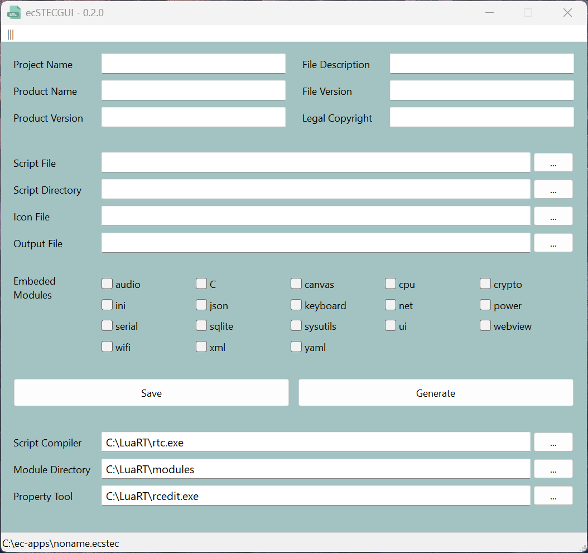
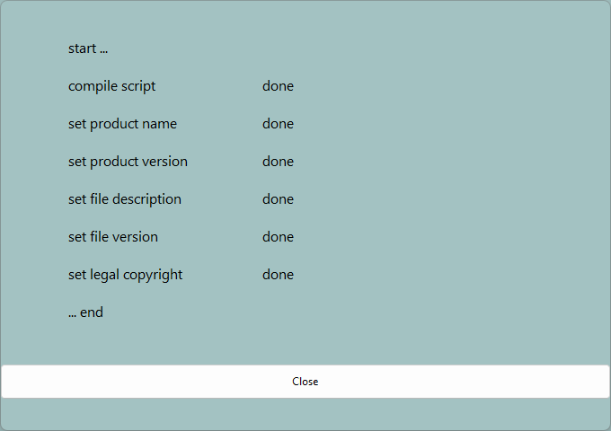

# ecSTECGUI

This application is a graphical user interface that allows you to create standalone executable applications for Windows from your LuaRT scripts. You can manage multiple scripts and store the necessary parameters in a json file. This makes it easy to generate an EXE file of your project. You can also change the EXE file properties.

> [!IMPORTANT]
>It depends on LuaRT [rtc](https://github.com/samyeyo/rtc) and Electron [rcedit](https://github.com/electron/rcedit).
>
>* rtc is a LuaRT script to executable compiler
>* rcedit is a command line tool to edit resources of exe

> [!CAUTION]
> This application is still in the development stage.

> [!NOTE]
It was developed in [Lua](https://www.lua.org/) with the help of the windows programming framework [LuaRT](https://www.luart.org/).
