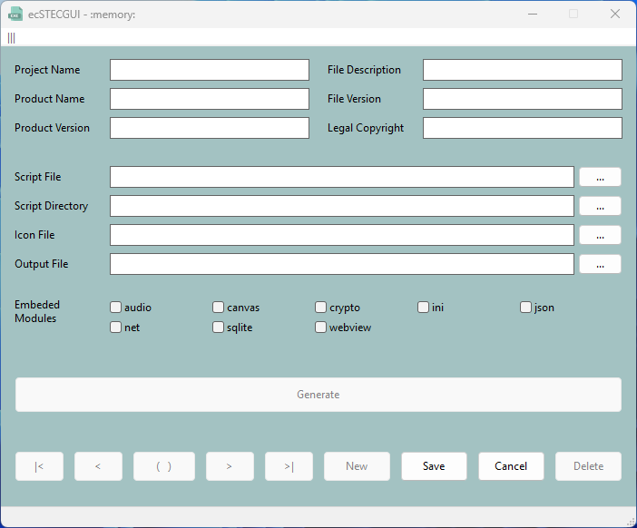

# ec-stec-gui

ecSTECGUI is a graphical user interface that allows you to create standalone executable applications for Windows from your LuaRT scripts. You can manage multiple scripts and store the necessary parameters. This makes it easy to generate an EXE file of your project.

> [!NOTE]
>It depends on LuaRT [rtc](https://github.com/samyeyo/rtc) and Electron [rcedit](https://github.com/electron/rcedit).

* rtc is a LuaRT script to executable compiler
* rcedit is a command line tool to edit resources of exe

